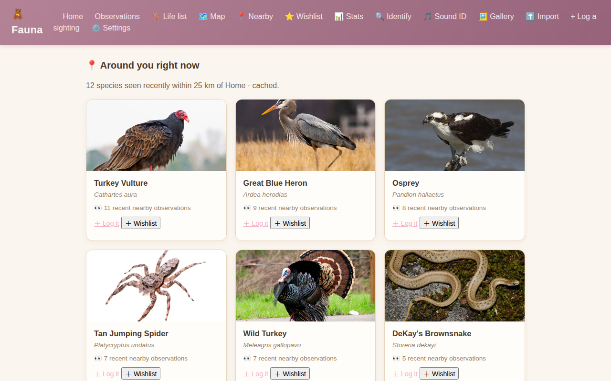
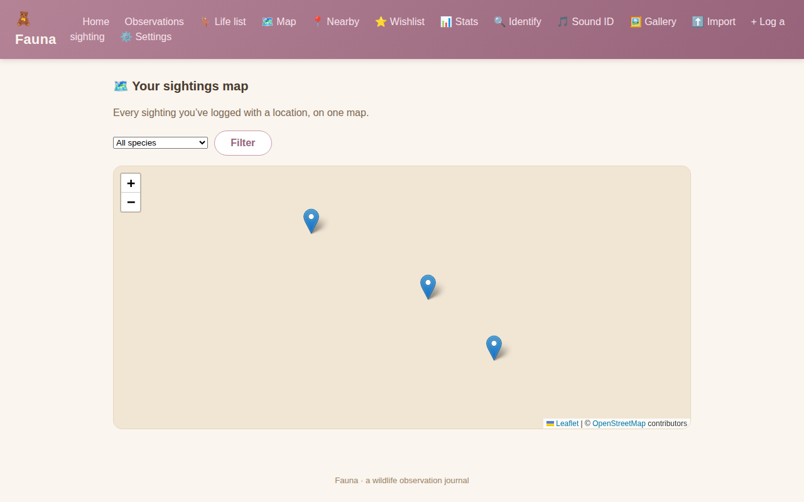
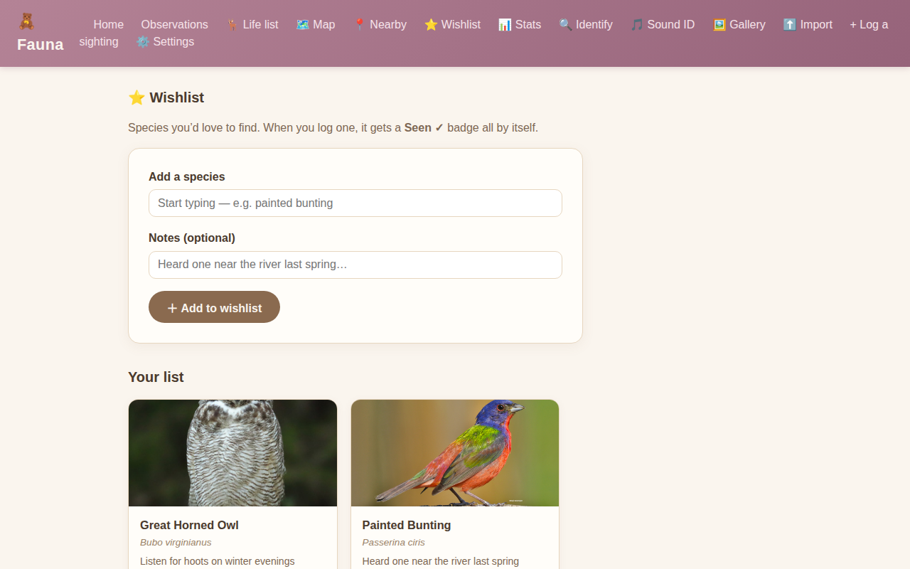
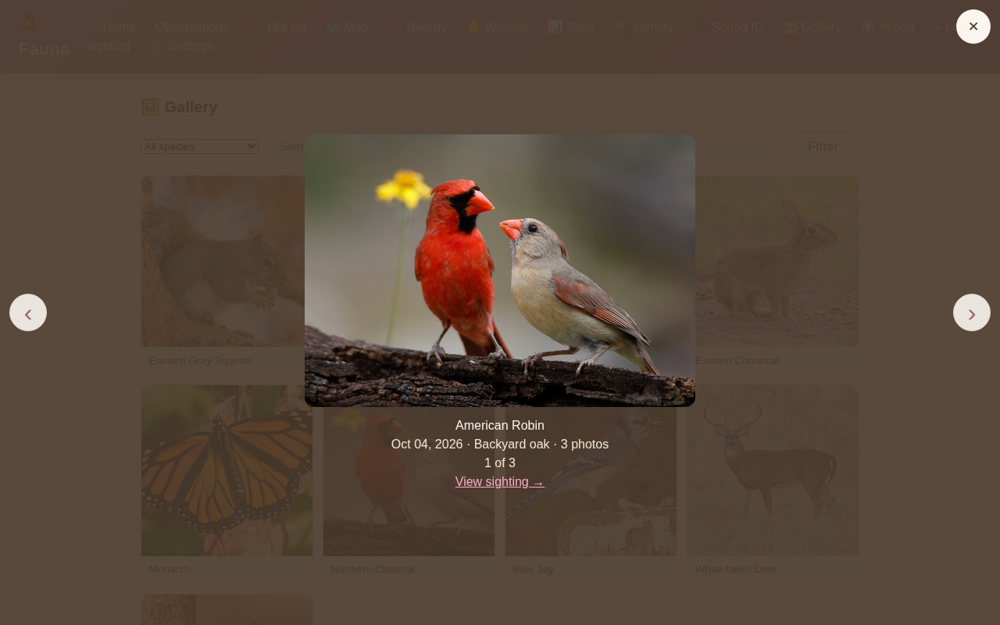
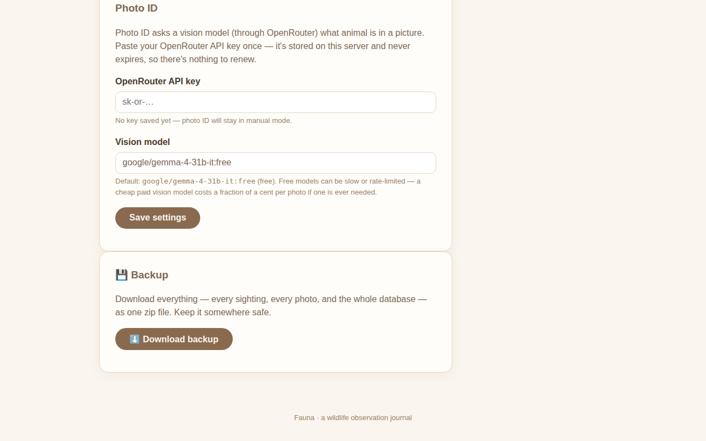
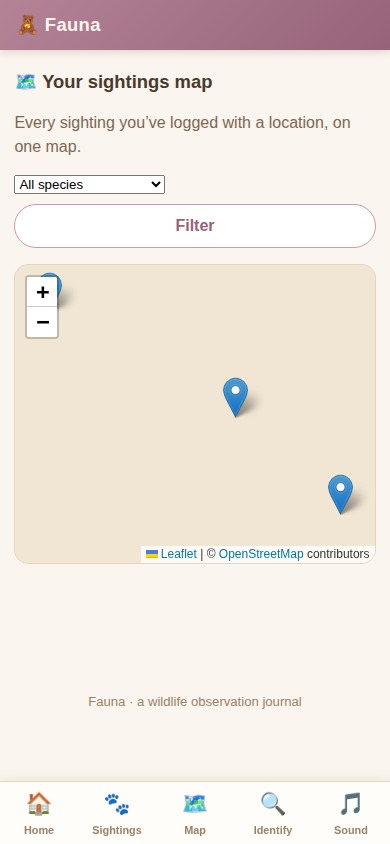
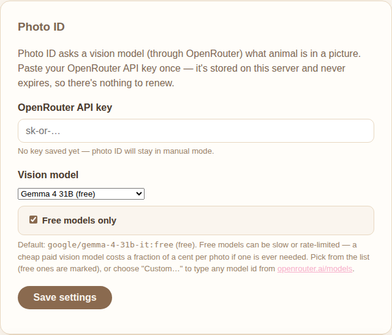

# Fauna 🦌

**Working name — it will change.** A wildlife observation journal: think the Merlin bird app, but for all wildlife — squirrels, birds, bunnies, you name it. Log sightings, identify species, and track a life list, all self-hosted.

A wildlife observation journal built as a gift. Same bones as [Verdant](https://github.com/Elyld/Verdant): FastAPI + SQLite, Docker on your own server, nothing in the cloud.

## Quick start

```bash
docker compose up -d
# open http://localhost:4001  (or set FAUNA_PORT in your environment)
```

Local dev:

```bash
python3 -m venv .venv && .venv/bin/pip install -r requirements.txt -r requirements-dev.txt
PYTHONPATH=. .venv/bin/python -m pytest -q
PYTHONPATH=. .venv/bin/uvicorn app.main:app --reload --port 4001
```

Data lives in `./data` (SQLite) and `./photos` (observation pictures) — both are Docker volumes, so they survive rebuilds.

## Deploying in Dockge (GHCR image)

Fauna publishes a ready-made image to GitHub Container Registry on every push to `main`, so Dockge (or Portainer, or plain compose) can run it with zero build step:

```yaml
services:
  fauna:
    image: ghcr.io/elyld/fauna:latest
    container_name: fauna-wildlife-journal
    restart: unless-stopped
    ports:
      - "${FAUNA_PORT:-4001}:8000"
    environment:
      FAUNA_DATA_DIR: /data
      FAUNA_UPLOAD_DIR: /photos
      FAUNA_DATABASE_URL: sqlite:////data/fauna.db
    volumes:
      - ./data:/data
      - ./photos:/photos
```

Paste that into a new Dockge stack (or just use this repo's `docker-compose.yml` as-is — it already pulls the image), hit deploy, and open the host's port 4001. Updating is `docker compose pull && docker compose up -d`, or Dockge's update button — your sightings live in the bind-mounted `./data` and `./photos` folders, not the image, so nothing is lost.

## Roadmap (Phase 1)

- [x] Observation logging API (species, count, date/time, GPS, location name, notes)
- [x] Photo uploads served at `/photos`
- [x] Species search/autocomplete backed by iNaturalist (`GET /api/species/search?q=robin`)
- [x] Pink-themed web UI: home (`/`), observations (`/observations`), log-a-sighting form with iNaturalist autocomplete (`/observations/new`)
- [x] Photo ID (`/identify`): upload a photo → vision-model suggestions → confirm → prefilled sighting form (needs an OpenRouter key in Settings, see below)
- [x] Bird sound ID (`/identify-audio`): record/upload a clip → BirdNET analysis → suggestions → prefilled sighting form
- [x] Range maps per species (`/species/<name>`): research-grade iNaturalist observation points on a Leaflet map, cached 7 days, with your own sightings pinned — click any species on the life list
- [x] Life list (`/life-list`): one row per species ever logged, sortable by most recent / most seen / A–Z
- [x] Stats (`/stats`): sightings-per-month bars + yearly activity heatmap
- [x] Observation search & "needs ID" filter on `/observations` (+ `?q=` / `?needs_id=` on the JSON API)
- [x] Edit sightings (`/observations/{id}/edit`, `PUT /api/observations/{id}`)
- [x] CSV export (`GET /api/observations/export.csv`, "Export CSV" button)
- [x] eBird CSV import (`/import`): upload a "Download My Data" export → preview → confirm, with dedup
- [x] Photo gallery (`/gallery`): all sighting photos in a grid, filterable by species + text search, with a lightbox view
- [x] Multi-photo sightings: attach several photos per sighting (`POST /api/observations/{id}/photos`); the gallery lightbox cycles through them, the first photo stays the cover, and deleting a sighting removes all its files
- [x] Sightings map (`/map`): Leaflet pins for every sighting with GPS coordinates, with a species filter — popups show a thumbnail, date, and a link to the sighting
- [x] "Around you right now" (`/nearby`): the 12 species most recently observed within 25 km of your home location (research-grade iNaturalist data, cached 7 days), each with "＋ Log it" and "＋ Wishlist" buttons
- [x] Wishlist (`/wishlist`): species you'd love to find, with thumbnails, notes, range-map links, and an automatic "Seen ✓" badge when you log one
- [x] Mobile-friendly quick-log: responsive pages, bottom tab bar, camera-first photo capture, installable PWA

## Bringing your eBird history

If you've been logging birds in eBird or Merlin, bring it all over:

1. On [eBird.org](https://ebird.org) go to **My eBird → Download My Data** and download the CSV.
2. In Fauna open **⬆️ Import**, upload the file, and check the preview.
3. Hit **Import** — done.

The preview shows exactly what will happen first: how many sightings are new,
how many are already in your journal (skipped automatically via each row's
eBird Submission ID), and which rows were skipped and why. Importing the same
file twice is a safe no-op. `X` counts ("present, not counted") come in as 1
with a note; dates/times, locations, and your observation notes all carry over.

## Mobile + PWA

Every page is responsive down to phone widths: the desktop nav gives way to a
bottom tab bar (Home · Sightings · Identify · Sound), the sighting form leads
with a big photo button and tucks the rest into a "More details" section, and
inputs stay at 16px so iOS doesn't auto-zoom.

Fauna is installable as an app: it serves a `manifest.json` (`/manifest.json`)
with a teddy-bear icon, theme color, and standalone display — on Android use
Chrome's "Add to Home screen" / "Install app", on iOS use Safari's Share →
"Add to Home Screen".

Camera capture: photo inputs use `capture="environment"`, so on phones the
camera opens directly (gallery is still offered by the OS picker).

Offline support: a service worker (`/sw.js`) caches the app shell, pages, and
photos, so the app opens with no signal. If you log a sighting while offline,
it's queued in an on-device outbox (IndexedDB) — a "📶 N sightings waiting to
sync" banner appears, and everything syncs through the normal API when the
connection returns (automatically, or via "Sync now"). Species search, photo
ID, and sound ID need a connection, and the app says so plainly instead of
failing weirdly.

Demo data + screenshots: with the app running, `scripts/seed_demo.py` seeds five charming observations (real iNaturalist names and photos) via the API, and `scripts/screenshots.py` captures `docs/screenshots/` with Chrome for Testing.

## Range maps

Click any species on the 🦌 Life list to open its page: a card with the
species' photo and facts, a map of where it's normally seen (research-grade
iNaturalist observations, plotted with Leaflet), and your own sightings of
that species pinned on the same map. Range data is cached for 7 days so
repeat visits don't hammer iNaturalist's API, and the page renders fine even
if the map library can't load.

## Photo gallery

🖼️ Gallery shows every sighting photo in a grid, most recent first — filter
by species or search, click any photo for a full-size lightbox with the
species, date, and location. Sightings can now carry **multiple photos**:
attach several at once from the sighting form, and the lightbox lets you flip
through them with ‹ › arrows or the keyboard. The first photo stays the cover
everywhere else (cards, life list, exports). Older sightings that predate
multi-photo get their existing photo carried over automatically.

## Sightings map

🗺️ **Map** pins every sighting you've logged with GPS coordinates — one map
of where *you've* been (the species page shows where the species is normally
seen; this is your own trail). Filter by species, click a pin for a thumbnail,
date, and a link to the sighting. Sightings imported from eBird carry
coordinates, so they show up too.

## Around you right now

📍 **Nearby** answers "what's being seen around me lately?": the 12 species
most recently observed within 25 km of your home location, from research-grade
iNaturalist observations. Set your home location once in ⚙️ Settings (there's a
"📍 Use my location" button, or type coordinates by hand — it's only ever used
for this lookup). Results are cached for 7 days per month — what's nearby
changes seasonally, not daily. Each card has **＋ Log it** (prefills the
sighting form) and **＋ Wishlist** buttons.

## Wishlist

⭐ **Wishlist** is the "hope to see" list: add species via the same iNaturalist
autocomplete, with optional notes ("heard one near the river last spring").
Each entry shows a thumbnail, a 🗺️ range-map link, and — the nice part — an
automatic **Seen ✓** badge the moment you log that species. The badge is
derived when the page loads, so there's nothing to keep in sync.

## Screenshots

<table>
  <tr>
    <td><br><em>📍 Nearby — what's being seen around home</em></td>
    <td><br><em>🗺️ Sightings map — her own trail</em></td>
  </tr>
  <tr>
    <td><br><em>⭐ Wishlist — hope-to-see species</em></td>
    <td><br><em>🖼️ Gallery lightbox — flipping through one sighting's photos</em></td>
  </tr>
  <tr>
    <td><br><em>💾 One-click full backup in Settings</em></td>
    <td><br><em>🗺️ Map on mobile, with the bottom tab bar</em></td>
  </tr>
  <tr>
    <td colspan="2"><br><em>⚙️ Settings — vision model dropdown with free-models filter</em></td>
  </tr>
</table>

More in `docs/screenshots/` (home, observations, life list, stats, identify,
sound ID, import, gallery, and mobile views).

## Backups

On the ⚙️ Settings page, the **💾 Backup** section's "Download backup" button
saves everything as one zip file (`fauna-backup-YYYYMMDD-HHMM.zip`):

- `fauna.db` — a consistent snapshot of the whole database, taken with
  `VACUUM INTO` so it's correct even while the app is running
- `photos/` — every sighting photo
- `observations.json` — every sighting in plain, human-readable JSON
- `settings.json` — your settings (API keys are never included)
- `README.txt` — restore steps

To restore: stop the app, replace `fauna.db` and the `photos/` folder with
the copies from the zip, and start the app again. Large photo libraries back
up fine — the server just notes it in the logs if photos exceed ~500 MB.

## Species data

Species identification runs on the public [iNaturalist API](https://api.inaturalist.org/v1/docs/) — the open equivalent of what powers Merlin: a taxonomy database covering essentially all wildlife, plus millions of observations for range/location data. No API key needed for the read endpoints used here. eBird/GBIF are candidates for later phases.

## Photo ID setup

The 🔍 Identify page names the animal in a photo with a vision model through
[OpenRouter](https://openrouter.ai). iNaturalist's own computer-vision
endpoint isn't used because it needs a per-user token that expires every 24
hours (a daily copy-paste chore); an OpenRouter key is pasted once and never
expires.

Setup (one time):

1. Open Fauna's ⚙️ Settings page.
2. Paste an OpenRouter API key (the same kind Verdant uses) and save. The key
   is stored on the server and is never shown back in the UI.
3. Pick a vision model from the dropdown — it lists OpenRouter's vision-capable
   models (free ones marked), with a "Free models only" filter and a "Custom…"
   option for typing any model id by hand. It defaults to
   `google/gemma-4-31b-it:free`, so photo ID costs nothing. Free models can be
   slow or rate-limited; if one ever flakes, a cheap paid vision model costs a
   fraction of a cent per photo.

How it works: the model names the animal (up to 3 ranked guesses with
confidence), iNaturalist's free no-login taxonomy data attaches canonical
names, thumbnails, and links, and she confirms the pick before anything is
saved — the AI is a suggester, never the decider.

Legacy fallback: if no OpenRouter key is configured but `INAT_API_TOKEN` is
set in the environment, the Identify page falls back to iNaturalist computer
vision (tokens expire after 24 hours, so this needs daily renewing). With
neither configured, the page saves the photo and offers manual entry.

## Sound ID setup

The 🎵 Sound ID page analyzes bird recordings with
[BirdNET-Analyzer](https://github.com/birdnet-team/birdnet-analyzer)
(Merlin Sound-ID style, but server-side: she records or uploads a short clip,
the server analyzes it a few seconds later — live real-time listening isn't
feasible in a web v1).

- Install: `pip install -r requirements.txt` includes `birdnet-analyzer`.
  It's heavy (~700MB — TensorFlow) and downloads a ~230MB model on first
  analysis (cached in the package's `checkpoints/` dir; the Dockerfile
  pre-downloads it at build time). The app runs fine without it: the Sound ID
  page then explains it's not set up instead of erroring.
- Phone recordings are usually `webm`/`mp4` — BirdNET reads those via
  `ffmpeg`, which the Dockerfile installs. (Plain `wav` needs nothing.)
- Non-bird sounds the model knows (engine noise, sirens…) are filtered out
  of the suggestions automatically.

## Tests

Live-network tests are opt-in (same convention as Verdant's deselected live tests):

```bash
# default: skips the live iNaturalist test
PYTHONPATH=. .venv/bin/python -m pytest -q
# include it:
FAUNA_LIVE_TESTS=1 PYTHONPATH=. .venv/bin/python -m pytest -q
```

## Renaming

The app name lives in exactly three places: `APP_NAME` in `app/version.py`, this README, and the `docker-compose.yml` service/container names. Update those and the rename is done.
